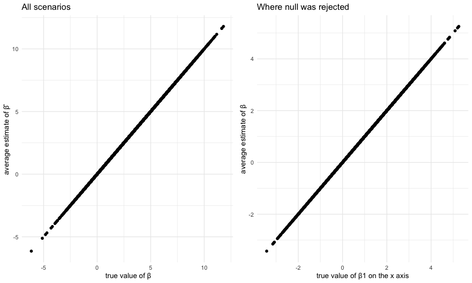

Homework 5
================
Laura Lynch, LL3255
11/11/2019

Problem 1
=========

``` r
# Load the data
set.seed(10)

iris_with_missing = iris %>% 
  map_df(~replace(.x, sample(1:150, 20), NA)) %>%
  mutate(Species = as.character(Species))
```

### Function

Fill in missings in iris dataframe

``` r
replace_iris = function(input_x) {
  
  # If null and numeric, replace with mean value for that column
  if(is.numeric(input_x)) {replace(input_x, is.na(input_x), mean(input_x,na.rm = TRUE))}
  
  # If null and character, replace with "virginica"
  else if(!is.numeric(input_x)) {replace(input_x, is.na(input_x), "virginica")}
  
}

# map it
complete_iris = map_df(iris_with_missing, ~ replace_iris(.x))

complete_iris
```

    ## # A tibble: 150 x 5
    ##    Sepal.Length Sepal.Width Petal.Length Petal.Width Species
    ##           <dbl>       <dbl>        <dbl>       <dbl> <chr>  
    ##  1         5.1          3.5         1.4         0.2  setosa 
    ##  2         4.9          3           1.4         0.2  setosa 
    ##  3         4.7          3.2         1.3         0.2  setosa 
    ##  4         4.6          3.1         1.5         1.19 setosa 
    ##  5         5            3.6         1.4         0.2  setosa 
    ##  6         5.4          3.9         1.7         0.4  setosa 
    ##  7         5.82         3.4         1.4         0.3  setosa 
    ##  8         5            3.4         1.5         0.2  setosa 
    ##  9         4.4          2.9         1.4         0.2  setosa 
    ## 10         4.9          3.1         3.77        0.1  setosa 
    ## # … with 140 more rows

``` r
# Checks >> Sepal.Length Mean 5.819, Sepal.Width Mean 3.075, Petal.Length Mean 3.765, Petal.Width Mean 1.192 
# iris_with_missing
```

Problem 2
=========

### Tidy Dataframe

``` r
# Dataframe containing all file names
df_read = list.files(path = "./data")

# Function to read in individual csv files

  csv_content =  data_frame(files =  df_read) %>%
  mutate(
    extract_data = map(files, ~read_csv(str_c("./data/", .x)))) %>% 
    #unnest to extrarct variables
  unnest(cols = extract_data) %>%
    #tidy weeks and obserrvations
    pivot_longer(
      cols = week_1:week_8,
      names_to = "week",
      values_to = "observation"
    ) %>%
    # subject ID
  mutate(subject_id = 
           files %>%
           str_extract("\\d{2}")) %>%
  # arm
  mutate(arm = 
           files %>%
           str_extract("[:lower:]{3}"))
```

### Spagetti Plot

``` r
# Make a spaghetti plot showing observations on each subject over time, and comment on differences between groups.
csv_content %>% 
  group_by(subject_id) %>%
  ggplot(aes(x = week, y = observation, group = subject_id, color = arm)) +
  geom_path() + 
  labs(caption = "observations on each subject over time") + 
  viridis::scale_color_viridis(
    discrete = TRUE) + 
  theme(legend.position = "bottom")
```


• Observations for the experimental group are positively correlated with time and great than the observation in the controrl group which are negatively corerlated with time.

Problem 3
=========

### Linear Regression Model

``` r
# function
set.seed(10)

sim_regression = function(n = 30, beta0 = 2, beta1 = 0, variance = 50) {
  # data for simulation
  sim_data = tibble(
    x = rnorm(n, mean = 0, sd = 1),
    y = beta0 + beta1 * x + rnorm(n, 0, 7.07)
    )
 
  # regression model
  ls_fit = lm(y ~ x, data = sim_data)
  
  broom::tidy(ls_fit)
}


# visualize results from function

output = 
  vector("list", length = 100)
  for (i in 1:100) {
  
  output[[i]] = sim_regression(beta1 = 1)
  
}

bind_rows(output) 
```

    ## # A tibble: 200 x 5
    ##    term        estimate std.error statistic p.value
    ##    <chr>          <dbl>     <dbl>     <dbl>   <dbl>
    ##  1 (Intercept)   0.362       1.27    0.284  0.779  
    ##  2 x            -1.44        1.39   -1.04   0.308  
    ##  3 (Intercept)   3.16        1.21    2.60   0.0146 
    ##  4 x             0.634       1.23    0.513  0.612  
    ##  5 (Intercept)   0.881       1.19    0.738  0.467  
    ##  6 x             3.10        1.20    2.58   0.0155 
    ##  7 (Intercept)   0.629       1.21    0.518  0.609  
    ##  8 x             0.0375      1.20    0.0311 0.975  
    ##  9 (Intercept)   4.09        1.20    3.42   0.00196
    ## 10 x             2.61        1.20    2.17   0.0388 
    ## # … with 190 more rows

``` r
sim_results = 
  tibble(beta_ones= c(1,2,3,4,5,6)) %>%
  mutate(
    output_list = map(.x = beta_ones, ~ rerun(1000, sim_regression(beta1 = .x))),
    beta_hats = map(output_list, bind_rows)) %>% 
  select(-output_list) %>% 
  unnest(beta_hats) %>%
  filter(term != "(Intercept)") 

sim_results
```

    ## # A tibble: 6,000 x 6
    ##    beta_ones term  estimate std.error statistic p.value
    ##        <dbl> <chr>    <dbl>     <dbl>     <dbl>   <dbl>
    ##  1         1 x       2.38       1.05     2.26    0.0316
    ##  2         1 x       0.652      1.66     0.392   0.698 
    ##  3         1 x      -2.44       1.58    -1.54    0.134 
    ##  4         1 x       0.245      1.32     0.186   0.854 
    ##  5         1 x       0.138      1.27     0.109   0.914 
    ##  6         1 x      -0.120      1.30    -0.0924  0.927 
    ##  7         1 x       0.612      0.922    0.663   0.513 
    ##  8         1 x       0.0846     0.876    0.0966  0.924 
    ##  9         1 x      -0.616      1.38    -0.448   0.658 
    ## 10         1 x       2.35       1.11     2.12    0.0427
    ## # … with 5,990 more rows

``` r
# plot showing the proportion of times the null was rejected (the power of the test) on the y axis and the true value of β1 on the x axis
sim_results %>% 
  janitor::clean_names() %>%
  mutate(sig= p_value< 5.0e-02,
         total= nrow(sim_results)) %>%
  mutate(true_sig= sum(sig, na.rm = TRUE)) %>%
  mutate(pwr= true_sig/total) %>% 
  ggplot(aes(x = estimate, y = pwr)) + 
  geom_point()
```

 • Describe the association between effect size and power

``` r
# Make a plot showing the average estimate of β̂ 1 on the y axis and the true value of β1 on the x axis

one_plot=
  sim_results %>% 
  janitor::clean_names() %>%
  group_by(estimate) %>%
  summarise(mean= mean(estimate)) %>%
  ggplot(aes(x = estimate, y = mean)) + 
  geom_point() +
  labs(
    title = "Plot One",
    x = " true value of β",
    y = "average estimate of β̂ ")

# Make a second plot (or overlay on the first) the average estimate of β̂ 1 only in samples for which the null was rejected on the y axis and the true value of β1 on the x axis

two_plot=
  sim_results %>% 
  janitor::clean_names() %>%
  mutate(sig= p_value< 5.0e-02) %>%
  filter(sig == FALSE) %>%
  group_by(estimate) %>%
  summarise(mean= mean(estimate)) %>%
  ggplot(aes(x = estimate, y = mean)) + 
  geom_point() +
  labs(
    title = "Plot Two",
    x = "true value of β1 on the x axis",
    y = "average estimate of β" )

patchwork::plot_layout(one_plot + two_plot)
```

    ## $ncol



    ## 
    ## $nrow
    ## NULL
    ## 
    ## $byrow
    ## NULL
    ## 
    ## $widths
    ## NULL
    ## 
    ## $heights
    ## NULL
    ## 
    ## $guides
    ## NULL
    ## 
    ## $tag_level
    ## NULL
    ## 
    ## attr(,"class")
    ## [1] "plot_layout"

• Is the sample average of β̂ 1 across tests for which the null is rejected approximately equal to the true value of β1? Why or why not?
